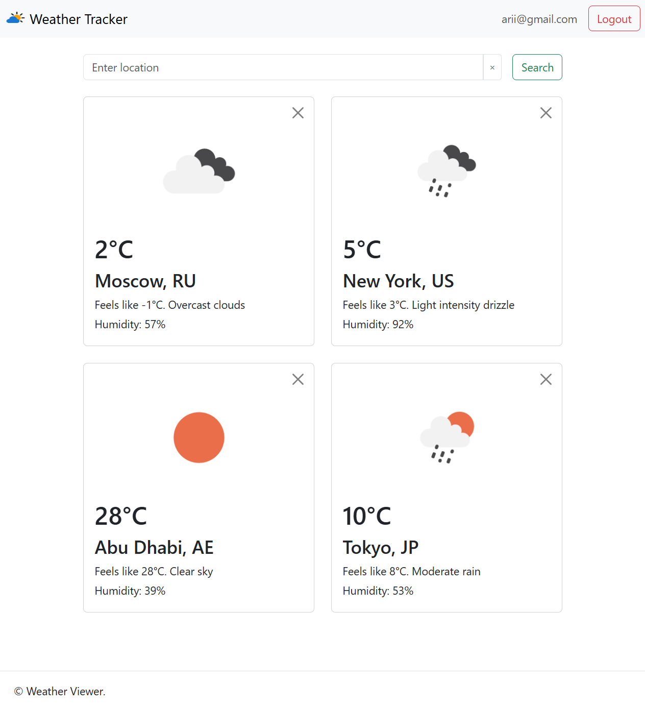

# Weather Tracker



Weather Tracker is a web application designed to display and manage weather information for various locations. The project
is built with Java using Spring MVC, Hibernate, and Thymeleaf. Weather data is retrieved from
the [OpenWeatherMap API](https://openweathermap.org/api).

## Application Features

- **Registration and Authentication**  
  Custom authentication implementation with session storage.

- **Add/Delete Locations**  
  Search for locations (cities) by name and add them to the tracked list. Deleting locations is also available.

- **Weather Display**  
  Displays current temperature, humidity, weather description (e.g., "Clear sky"), and a weather icon.

## Stack

- **Java 21**
- **Spring Framework (Spring MVC, Spring ORM, Spring Web)**
- **Hibernate** – ORM for database interaction
- **HikariCP** – Connection pool
- **Liquibase** – Database migration tool
- **Thymeleaf** – Template engine for UI rendering
- **Bootstrap 5.3** – UI framework for responsive design
- **MapStruct** – DTO mapping
- **PostgreSQL** – Primary database
- **H2** – In-memory database for testing
- **JUnit 5**, **Mockito**, **Hamcrest** – Testing frameworks
- **Logback** – Logging framework
- **Docker** – Containerization platform

## Usage

1. Go to `http://185.121.12.25:8080/weather-app/`.
2. Click the `Sign up here` button to register.
3. Log in by entering your username and password, then click `Sign In`.
4. On the `/weather-app/index` page:
    - Enter a city name in the `Enter location` input field and click the `Search` button.
    - In the displayed list of found locations, select the desired one and click the `Add` button.
5. The application will display the list of added locations and weather data for each one.

## Installation

1. Install **Docker** and **Docker Compose**.
2. Clone the repository:
   ```bash
   git clone https://github.com/AriiSib/weather-app.git
   cd weather-app
   ```
3. Build and start the containers:
    ```bash 
    docker-compose -f docker-compose.prod.yml up -d
    ```
4. Go to `http://localhost:8080/weather-app/`.